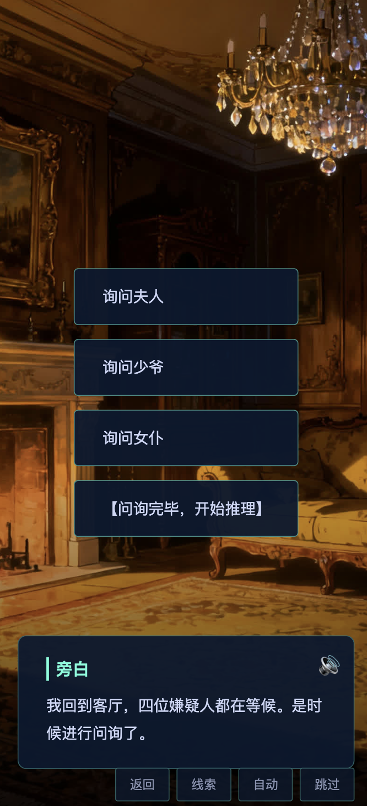

# 雪山庄事件

一个基于 Web 技术的视觉小说游戏（Galgame），讲述了一个发生在雪山庄的密室杀人事件。

## 项目简介

《雪山庄事件》是一款互动式推理视觉小说游戏，玩家将扮演一名侦探，在雪山庄中调查一起密室杀人案件。通过对话、收集线索、做出选择来推进剧情，最终揭开真相。

## 游戏截图




## 功能特性

- 🎮 **完整的游戏引擎**：支持对话、选择、线索收集、多结局系统
- 🎨 **精美的视觉效果**：背景图片、角色立绘、流畅的动画过渡
- 🔊 **丰富的音频体验**：BGM 背景音乐、角色语音配音
- 📱 **响应式设计**：适配不同屏幕尺寸
- 💾 **存档系统**：支持游戏进度保存和继续
- 🎯 **多结局系统**：根据玩家的选择走向不同的结局

## 技术栈

- **前端**：HTML5 + CSS3 + JavaScript (ES6+)
- **资源生成**：Node.js（语音、图片生成脚本）
- **音频处理**：Python（BGM 生成工具）

## 项目结构

```
galgame/
├── index.html          # 主页面
├── game.js            # 游戏引擎核心逻辑
├── script.js          # 游戏脚本数据
├── style.css          # 样式文件
├── generate_assets.js # 资源生成脚本（Node.js）
├── generate_assets.sh # 资源生成脚本（Shell）
├── BGMCreator/        # BGM 生成工具
│   ├── GenBGMDemo.py  # BGM 生成示例
│   └── Sign.py        # 签名工具
└── assets/            # 游戏资源
    ├── bgm/           # 背景音乐
    ├── voice/         # 角色语音
    ├── images/        # 图片资源
    └── asset_map.json # 资源映射表
```

## 快速开始

### 1. 克隆项目

```bash
git clone <repository-url>
cd galgame
```

### 2. 运行游戏

由于这是一个纯前端的 Web 项目，你可以通过以下方式运行：

**方式一：使用 Python 简单服务器**

```bash
python3 -m http.server 8000
```

然后在浏览器中访问 `http://localhost:8000`

**方式二：使用 Node.js 服务器**

```bash
npx http-server -p 8000
```

**方式三：直接打开**

直接用浏览器打开 `index.html` 文件（某些功能可能受限）

### 3. 生成资源（可选）

如果需要重新生成游戏资源（语音、图片等），需要配置 API 密钥：

1. 编辑 `generate_assets.js`，填入你的 API 配置
2. 运行生成脚本：

```bash
node generate_assets.js
```

或使用 Shell 脚本：

```bash
bash generate_assets.sh
```

## 游戏操作

- **点击对话框**：推进对话
- **点击选项**：做出选择
- **返回按钮**：返回上一句对话
- **线索按钮**：查看已收集的线索
- **自动按钮**：开启/关闭自动播放模式
- **跳过按钮**：跳过当前对话

## 开发说明

### 游戏脚本格式

游戏脚本定义在 `script.js` 中，使用 JSON 格式描述场景、对话、选择等。

### 资源管理

- 所有资源文件存放在 `assets/` 目录下
- `asset_map.json` 记录了资源文件的映射关系
- 资源生成脚本会自动更新资源映射表

### BGM 生成

BGM 生成工具位于 `BGMCreator/` 目录，使用 Python 编写。需要配置相应的 API 密钥才能使用。

## 浏览器兼容性

- Chrome/Edge（推荐）
- Firefox
- Safari
- 其他现代浏览器

## 许可证

MIT

## 贡献

欢迎提交 Issue 和 Pull Request！


